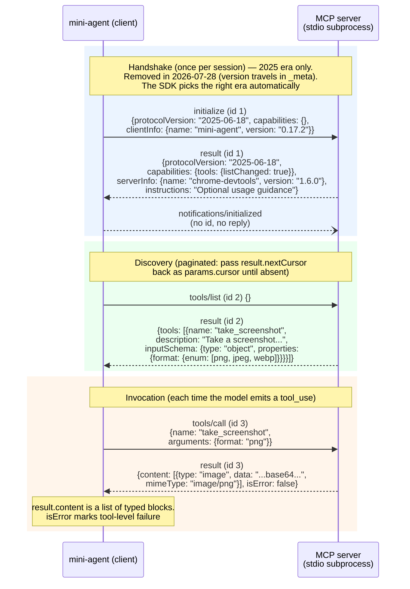

# Research: MCP support for mini-agent

Research notes for [issue #83 "[Feature]: Support MCP"](https://github.com/kowyo/mini-agent/issues/83).
Written 2026-08-16 against MCP spec revision **2026-07-28** (current) and **2025-06-18 / 2025-11-25**
(the handshake-based revisions most deployed servers still speak). All spec claims cite the revision
they come from. This document presents options and tradeoffs; it does not make the final call.

---

## 1. What MCP is, in one paragraph

The Model Context Protocol is a client–server protocol over **JSON-RPC 2.0**. A *server* is a small
program (or web service) that exposes capabilities — most importantly **tools** — in a standard,
discoverable format. A *client* is the thing embedded in an AI application (an agent like
mini-agent) that connects to servers, asks them what tools they have (`tools/list`), and invokes
them (`tools/call`) when the model requests it. The value proposition is that any server works with
any client: install `chrome-devtools-mcp` once and it works in Claude Code, Codex, Cursor, and —
after this feature — mini-agent. Spec home: <https://modelcontextprotocol.io/specification/>.

**An agent is a *client* (technically a "host" embedding a client per server connection).
mini-agent would never implement the server side.**

---

## 2. mini-agent today: the integration points an MCP client must fit

The whole tool pipeline is three small pieces, all synchronous:

| Integration point | Where | What it is |
|---|---|---|
| Tool schemas | `src/mini_agent/agent/tools/schemas.py:5` | `TOOLS: list[ToolParam]` — static list of Anthropic tool dicts (`name`, `description`, `input_schema`) |
| Tool dispatch | `src/mini_agent/agent/tools/handlers.py:7` | `TOOL_HANDLERS: dict[str, Any]` — name → sync callable returning `str` or content blocks |
| Agent loop | `src/mini_agent/agent/agent.py:23` (`agent_loop`) | Passes `TOOLS` on every request (`agent.py:54`), looks up `TOOL_HANDLERS.get(block.name)` (`agent.py:95`), appends a `tool_result` with the handler's output (`agent.py:113-119`), loops while `stop_reason == "tool_use"` (`agent.py:146`) |

Other relevant facts:

- **Everything is synchronous.** There is no `async` anywhere in `src/` — the loop uses the sync
  `Anthropic` client (`config.py:46`) and `client.messages.stream(...)` (`agent.py:63`). The
  official MCP SDK is asyncio-only, so a bridge is needed (§6.1).
- **Handlers may already return content-block lists**, not just strings:
  `run_read` returns `str | list[dict[str, Any]]` (`src/mini_agent/agent/tools/file.py`, images as
  base64 blocks). So `tool_result.content` already handles rich content — MCP image results map
  onto an existing pattern.
- **Config** is TOML at `~/.mini-agent/config.toml` (`config.py:25-27`); env from
  `~/.mini-agent/.env` (`config.py:41`). There is already a "home + project" dual-directory
  convention for skills: `~/.mini-agent/skills` and `<cwd>/.mini-agent/skills` (`config.py:30-39`)
  — issue #83's proposed `~/.mini-agent/mcp.json` + `<cwd>/.mini-agent/mcp.json` mirrors this.
- **Interrupts**: tool execution can raise `BashInterruptedError`/`KeyboardInterrupt`, and the loop
  back-fills "Command aborted" results for unfinished tool_use blocks (`agent.py:123-139`). An MCP
  call path must survive Ctrl-C the same way.
- **Output guarding**: bash output is capped at `MAX_OUTPUT = 50000` chars
  (`src/mini_agent/agent/tools/base.py:10`). MCP tools can return arbitrarily large results, so an
  equivalent cap is needed (Claude Code caps MCP output at 25,000 tokens, warns at 10,000, override
  via `MAX_MCP_OUTPUT_TOKENS` — <https://code.claude.com/docs/en/mcp>).
- **Runtime**: Python ≥ 3.14, deps `anthropic>=0.111.0` etc. (`pyproject.toml:6-17`). The MCP SDK
  (`mcp` on PyPI) requires only Python 3.10+, so it fits.

---

## 3. The protocol, as much as a tools-only client needs

### 3.1 Spec revisions — read this first, it's confusing

MCP is versioned by date strings (`YYYY-MM-DD`). Status as of 2026-08-16
(<https://modelcontextprotocol.io/specification/versioning>):

- **2026-07-28 — current.** A major redesign: MCP became *stateless*. The
  `initialize`/`notifications/initialized` handshake is **removed**; every request instead carries
  its protocol version and client capabilities in `_meta`
  (`io.modelcontextprotocol/protocolVersion`, `io.modelcontextprotocol/clientCapabilities`). A new
  mandatory `server/discover` RPC replaces up-front negotiation. HTTP sessions (`Mcp-Session-Id`)
  and SSE resumability are removed. Roots, Sampling, and Logging are **deprecated**.
  Changelog: <https://modelcontextprotocol.io/specification/2026-07-28/changelog>.
- **2025-11-25 and 2025-06-18 — final ("handshake era").** These define the classic
  `initialize` → `initialized` lifecycle that virtually all *deployed* servers speak today. Notably,
  pi-mcp-adapter (§5.3) still defaults to `protocolVersion: "legacy"` "preserving compatibility
  with deployed 2025-era servers" — good evidence of where the ecosystem actually is.

**Practical consequence:** a client written today must interoperate with handshake-era servers.
The official Python SDK v2 does this for you — it "probes protocol versions automatically and falls
back to the classic handshake on older ones" (<https://py.sdk.modelcontextprotocol.io/client/>).
If you use the SDK, you mostly don't care which era a server is from. The wire examples below use
the 2025-06-18 handshake because that's what you'll see in practice when debugging.

### 3.2 Lifecycle (handshake era, 2025-06-18)

Source: <https://modelcontextprotocol.io/specification/2025-06-18/basic/lifecycle>.

Three phases: **initialize → operate → shutdown**.

1. Client sends `initialize` with the latest protocol version it supports, its capabilities, and
   `clientInfo`.
2. Server responds with the agreed (or its own preferred) version, *its* capabilities, and
   `serverInfo` (+ optional `instructions` — free text you can put in the system prompt).
   If the client can't accept the server's version it SHOULD disconnect.
3. Client sends the `notifications/initialized` notification. Only then is normal traffic allowed.

Capability negotiation is how optional features are switched on. For a tools-only client the only
server capability that matters is `tools` (with optional sub-capability `listChanged`). The client
capabilities (`roots`, `sampling`, `elicitation`) are all optional — **a minimal client declares
none of them** (and in 2026-07-28, roots/sampling are deprecated anyway).

Shutdown has no protocol message. For stdio: close the child's stdin, wait, then SIGTERM, then
SIGKILL. For HTTP: just close the connection(s). The spec also says clients SHOULD put timeouts on
every request and send `notifications/cancelled` when a timeout fires.

### 3.3 The wire, end to end

What actually flows between mini-agent and a stdio server (newline-delimited JSON-RPC 2.0, one
message per line):



### 3.4 Transports

Source: <https://modelcontextprotocol.io/specification/2025-06-18/basic/transports>.

**stdio** — the client launches the server as a subprocess. Server reads JSON-RPC from stdin,
writes it to stdout; messages are newline-delimited and MUST NOT contain embedded newlines; stderr
is free-form logging the client may capture or ignore. Critical rule both ways: *nothing* that
isn't a valid MCP message may be written to the server's stdout or stdin. (This is why servers that
`print()` for debugging break clients.) Clients "SHOULD support stdio whenever possible" — it's the
transport for everything installed via `npx`/`uvx`.

**Streamable HTTP** — one endpoint URL (e.g. `https://example.com/mcp`) accepting POST.
Every client JSON-RPC message is a new POST; the server answers with a JSON body (possibly
streamed — the SDK handles the response framing either way). Handshake-era (2025) servers add
per-session and per-request headers, but these are removed in 2026-07-28 and the SDK manages
them automatically — nothing for mini-agent to implement. Client-side, headers are the auth
channel (e.g. a bearer token).

**HTTP+SSE (2024-11-05)** — the deprecated predecessor, formally Deprecated in 2026-07-28.
Out of scope for mini-agent: do not implement or configure it; the two transports above cover
everything current.

### 3.5 Tools

Source: <https://modelcontextprotocol.io/specification/2025-06-18/server/tools>.

- **Definition**: `name` (unique per server), optional `title`, `description`,
  `inputSchema` (JSON Schema object), optional `outputSchema`, optional `annotations`
  (e.g. `readOnlyHint`, `destructiveHint`).
- **`tools/list`** is paginated via `cursor`/`nextCursor`.
- **`tools/call` result**: `content` — a list of blocks of type `text`, `image` (base64 +
  mimeType), `audio`, `resource_link`, or embedded `resource`; optional `structuredContent` (JSON
  matching `outputSchema`, with a mirrored JSON string in a text block for backward compat).
- **Two error channels** — this trips people up:
  1. *Protocol errors* (unknown tool, malformed request) come back as JSON-RPC `error` objects.
  2. *Tool execution errors* (API failed, bad input semantics) come back as a **successful** result
     with `isError: true` and the error message in `content`, so the *model* can see it and retry.
  A client should convert (1) into an Anthropic `tool_result` with `is_error: true` too, rather
  than crashing the loop — exactly how the loop already stringifies unknown tools (`agent.py:107`).
- **`notifications/tools/list_changed`**: servers with `listChanged: true` may push this;
  the client should re-run `tools/list`. Fine to ignore in a v1 (the tool set is then fixed at
  connect time — note that changing the `tools` array mid-conversation also invalidates the
  Anthropic prompt cache, which is a reason Claude-family clients throttle this).
- Practical client guidance: apply timeouts to `tools/call` and log usage.

### 3.6 The rest of the protocol (know it exists, skip it in v1)

- **Resources** (`resources/list`, `resources/read`) — server-exposed data blobs by URI.
  Claude Code exposes them as `@server:uri` mentions. Optional capability; a tools-only client
  needs nothing.
- **Prompts** (`prompts/list`, `prompts/get`) — parameterized prompt templates; Claude Code and
  pi-mcp-adapter surface them as slash commands (`/mcp__server__prompt`). Optional.
- **Sampling** — the *server* asks the *client* to run an LLM completion. **Deprecated in
  2026-07-28** ("integrate directly with LLM provider APIs instead"). Don't implement.
- **Elicitation** — server asks the client to collect user input mid-call. Optional; reshaped in
  2026-07-28 into "multi round-trip requests". Don't implement in v1 (servers that need it fail
  gracefully when the capability isn't declared).
- **Roots** — client tells the server which directories are in scope. **Deprecated in 2026-07-28**
  (pass paths as tool arguments instead). Don't implement.
- **Logging / progress / ping / cancellation** — utilities. The SDK handles ping/cancellation;
  you can ignore log notifications or dump them at debug level.

**Bottom line: a minimal, spec-compliant, useful MCP client = transport + lifecycle +
`tools/list` + `tools/call`.** Everything else is negotiated off.

---

## 4. The official Python SDK (`mcp`)

Repo: <https://github.com/modelcontextprotocol/python-sdk> · Docs: <https://py.sdk.modelcontextprotocol.io/>

- Package **`mcp`** on PyPI (`uv add mcp`), **Python 3.10+** — compatible with mini-agent's 3.14.
- **v2 is the current stable line** and supports the 2026-07-28 spec *and every earlier revision*;
  it probes and "falls back to the classic handshake on older" servers, so version negotiation,
  request envelopes, cancellation, and era differences are the SDK's problem, not yours.
  (v1 pinned as `mcp>=1.28,<2` still exposes the older `ClientSession` API you'll see in most blog
  posts; new code should use v2's `Client`.)
- **Fully async** (asyncio). The client is an async context manager; entering connects and
  negotiates, leaving disconnects (and for stdio, reaps the subprocess per the spec's
  close-stdin → wait → SIGTERM → SIGKILL sequence). A `Client` object is single-use.
- Transport is inferred from the constructor argument: a URL string → Streamable HTTP;
  `stdio_client(StdioServerParameters(...))` → subprocess.
  Note the stdio child gets a minimal env allow-list (`HOME`, `PATH`, `USER`, …) with your `env=`
  merged on top — so config `env` is *additive*, matching the ecosystem convention.
- Tool surface: `await client.list_tools()` → `.tools` each with `name`, `title`, `description`,
  `input_schema` (note: Python SDK v2 uses snake_case attribute names for the wire's
  `inputSchema`); `await client.call_tool(name, args)` → `CallToolResult` with `.content` (typed
  blocks: `TextContent`, `ImageContent`, `AudioContent`, `ResourceLink`, `EmbeddedResource`),
  `.structured_content`, `.is_error`. Tool failures **do not raise** — check `.is_error`; only
  JSON-RPC protocol errors raise `MCPError`.

Minimal tools-only client (docs-verbatim shapes, composed):

```python
import asyncio

from mcp import Client, StdioServerParameters
from mcp.client.stdio import stdio_client
from mcp.types import ImageContent, TextContent


async def main() -> None:
    params = StdioServerParameters(
        command="npx",
        args=["-y", "chrome-devtools-mcp@1.6.0"],
        env={},  # merged over a minimal allow-list env
    )
    async with Client(stdio_client(params)) as client:
        print(client.server_info, client.protocol_version)

        tools = []
        cursor = None
        while True:  # tools/list pagination
            page = await client.list_tools(cursor=cursor)
            tools.extend(page.tools)
            if page.next_cursor is None:
                break
            cursor = page.next_cursor

        result = await client.call_tool("take_screenshot", {"format": "png"})
        if result.is_error:
            print("tool failed:", result.content)
        for block in result.content:
            if isinstance(block, TextContent):
                print(block.text)
            elif isinstance(block, ImageContent):
                print("image:", block.mime_type, len(block.data), "b64 chars")


asyncio.run(main())
```

For HTTP with auth headers, you construct the httpx client yourself:

```python
import httpx2
from mcp.client.streamable_http import streamable_http_client

http = httpx2.AsyncClient(
    headers={"Authorization": "Bearer ..."}, timeout=httpx2.Timeout(30.0, read=300.0)
)
async with Client(
    streamable_http_client("https://mcp.example.com/mcp", http_client=http)
) as client:
    ...
```

(OAuth for remote servers exists in the SDK — `httpx2.AsyncClient(auth=OAuthClientProvider(...))` —
but it drags in browser flows, token storage, and callback servers. Every serious client treats it
as a later milestone; header-based bearer tokens cover most remote servers today.)

---

## 5. How real coding agents integrate MCP

### 5.1 Claude Code

Source: <https://code.claude.com/docs/en/mcp> (fetched 2026-08-16).

- **Config**: three scopes — *local* (default, per-project entry stored in `~/.claude.json`),
  *project* (`.mcp.json` at repo root, checked in, requires interactive user approval before
  first use), *user* (`~/.claude.json`, all projects). Highest-precedence scope wins whole-entry;
  no field merging.
- **Format** (the de-facto ecosystem standard that Cursor/Codex-importers/pi all read):

  ```json
  {
    "mcpServers": {
      "airtable": {
        "command": "npx",
        "args": ["-y", "airtable-mcp-server"],
        "env": {"AIRTABLE_API_KEY": "${AIRTABLE_API_KEY}"}
      },
      "github": {
        "type": "http",
        "url": "https://api.githubcopilot.com/mcp/",
        "headers": {"Authorization": "Bearer ${GITHUB_PAT}"}
      }
    }
  }
  ```

  An entry with no `type` is read as stdio; `type` accepts `http` (alias `streamable-http`), `sse`,
  `ws`. Env expansion supports `${VAR}` and `${VAR:-default}` in `command`, `args`, `env`, `url`,
  `headers`; an unset variable without default logs a warning and passes through literally.
- **Naming**: MCP tools surface to the model as `mcp__<server>__<tool>`, with characters outside
  `[A-Za-z0-9_-]` replaced by `_` (documented for the plugin form
  `mcp__plugin_<plugin>_<server>__<tool>`; same sanitization). The prefix keeps names collision-free
  and lets permission rules / hooks match `mcp__github__*`. Prompts become
  `/mcp__server__prompt` slash commands.
- **Context management**: "tool search" is on by default — MCP tool *definitions are deferred*;
  only names + server instructions load at session start, and Claude discovers full schemas
  on demand via a ToolSearch tool (threshold mode `ENABLE_TOOL_SEARCH=auto` loads schemas upfront
  until they'd exceed 10% of the context window). This is Anthropic's own answer to the context
  bloat problem in §6.
- **Guardrails**: per-server `timeout` (ms) / `MCP_TIMEOUT` startup timeout / `MCP_TOOL_TIMEOUT`;
  output limited to 25,000 tokens by default (`MAX_MCP_OUTPUT_TOKENS`), warning at 10k; connection
  retries with backoff; failed-server errors are surfaced *to the model*; OAuth via `/mcp`.

### 5.2 Codex (openai/codex, Rust)

Source: <https://developers.openai.com/codex/mcp> (fetched 2026-08-16); client crates
`codex-rs/rmcp-client`, `codex-rs/mcp-server` in the repo.

- Config in `~/.codex/config.toml` (or trusted-project `.codex/config.toml`), one TOML table per
  server: `[mcp_servers.<name>]` with `command`/`args`/`env`/`cwd` for stdio, or `url` +
  `bearer_token_env_var` / `http_headers` / `env_http_headers` for Streamable HTTP.
- Lifecycle/robustness knobs: `startup_timeout_sec` (default 10), `tool_timeout_sec` (default 60),
  `enabled = false` to keep-but-disable, `enabled_tools`/`disabled_tools` allow/deny lists,
  per-tool approval modes (`auto`/`prompt`/`writes`/`approve`).
- CLI mirrors Claude Code: `codex mcp add <name> -- <command...>`, `codex mcp list`,
  `codex mcp login <name>` (OAuth), `/mcp` in the TUI.
- Reads the server's `instructions` field at initialization as server-wide guidance and documents
  keeping "the first 512 characters self-contained" (truncation).

The pattern across both (and Cursor/Windsurf/pi): **same config vocabulary**
(command/args/env vs url/headers), **per-server timeouts**, **enable/disable and tool filtering**,
**namespaced tool names**, **approval gates**, **output caps**. Issue #83's config-file idea is
squarely inside this convention.

### 5.3 pi-mcp-adapter (read from source at /tmp/pi-mcp-adapter)

Repo: <https://github.com/nicobailon/pi-mcp-adapter>. This is the most instructive design for a
small agent because it explicitly targets the context-bloat critique (README.md:11-17 cites
Zechner's post directly).

**Architecture: an in-process extension, not an adapter process.** It's a TypeScript extension for
the Pi agent that links the official TS SDK (`server-manager.ts:1-15` imports `Client`,
`StreamableHTTPClientTransport` from `@modelcontextprotocol/client` and `StdioClientTransport`
from `@modelcontextprotocol/client/stdio`). The "adapter" is a *representation* choice, not a
process boundary:

- **One proxy tool instead of N tools.** By default the model sees a single `mcp` tool
  (~200 tokens) with modes: `search` (ranked keyword search over cached tool metadata),
  `describe`, `server` list, `instructions`, and `tool`+`args` to invoke
  (README.md:644-694; implementations in `proxy-modes.ts` — `executeSearch:496`,
  `executeDescribe:436`, `executeList:634`). "Two calls instead of 26 tools cluttering the
  context" (README.md:93).
- **Lazy lifecycle.** Servers don't start until first call; tool metadata is cached on disk
  (`metadata-cache.ts`, `~/.pi/agent/mcp-cache.json`) so search/describe work with *zero* running
  servers; idle servers are reaped after 10 min; `lifecycle` per server:
  `lazy`/`eager`/`keep-alive`/`lazy-keep-alive` (README.md:292-299).
- **Escape hatch back to normal tool-calling.** `directTools: true | string[]` promotes chosen
  tools to first-class agent tools (~150–300 tokens each; advisory at 75+), registered from the
  metadata cache without connecting (README.md:472-554, `tool-registrar.ts`).
- **Code mode as a third surface.** An `mcpScript` tool executes agent-written JavaScript in a
  worker thread (30 s default timeout, `mcp-code.ts:13`) with an injected `tools.search /
  describe / call` API, so multi-call MCP workflows collapse into one tool result
  (README.md:414-450).
- **Content mapping.** `tool-registrar.ts:187 transformMcpContent()` converts MCP content blocks
  into the host agent's content blocks; text passes through, images stay native, oversized text is
  spilled to temp files with the path returned so the agent can `read`/`grep` it — the "output
  guard": 50 KiB / 2,000 lines inline cap, binary blobs materialized to temp files
  (README.md:393-412).
- **Config**: reads the shared `.mcp.json` / `~/.config/mcp/mcp.json` formats plus imports of
  Claude Code/Cursor/Codex configs; `${VAR}` interpolation; per-server
  `requestTimeoutMs`, `includeTools`/`excludeTools` globs, `approveTools` call-time confirmation
  globs, `protocolVersion: "legacy" | "auto" | "2026-07-28"` (legacy default) (README.md:186-250).
- OAuth is fully implemented (`oauth.ts`, `mcp-auth-flow.ts`, OS credential store, headless flows)
  — and is by far the largest chunk of the codebase. A useful calibration: **transport + tools is
  small; auth is where the code goes.**

---

## 6. The "maybe you don't need MCP" counterpoints

All four sources agree on the *diagnosis* and differ on the *treatment*.

**The diagnosis — direct tool-calling over MCP has two structural costs:**

1. **Up-front context: every tool schema is in every request.** Zechner measured Playwright MCP at
   21 tools ≈ 13.7k tokens and Chrome DevTools MCP at 26 tools ≈ 18.0k tokens (~9% of a 200k
   context) *before the conversation starts*
   (<https://mariozechner.at/posts/2025-11-02-what-if-you-dont-need-mcp/>). Anthropic's
   engineering post describes agents connected to many servers processing "hundreds of thousands
   of tokens before reading a request"
   (<https://www.anthropic.com/engineering/code-execution-with-mcp>).
2. **Intermediate results flow through the model.** Chaining tool A → tool B means A's full output
   enters model context, gets *re-emitted by the model* as B's input, and both are paid for again
   on every subsequent turn. Anthropic's transcript-to-Salesforce example: ~50k extra tokens for a
   2-hour transcript; their code-execution rewrite of the same workflow: **150,000 → 2,000 tokens
   (-98.7%)**.

**The treatments:**

- **Zechner: skip MCP.** Coding agents already have bash. Wrap capabilities as small CLI scripts,
  document them in a README the agent reads on demand (his browser-tools README: **225 tokens** vs
  13–18k). Composability comes free (pipes, files); extension is "edit a 50-line script". Caveats
  he states: needs a code-execution harness, and you give up the ecosystem — you build and
  maintain every tool yourself. His own benchmarks found MCP *can* be efficient "if you take care".
- **Anthropic: keep MCP, hide it behind code.** Generate a file tree of typed wrappers
  (`servers/google-drive/getDocument.ts` etc.); the agent discovers tools by listing the
  filesystem and writes code that calls them, so schemas load progressively and intermediate data
  never enters context. Stated cost: you now need a secure sandbox with resource limits and
  monitoring — "code execution introduces its own complexity."
- **Cloudflare Code Mode: same idea, platform-shaped.** Convert MCP schemas to a TypeScript API,
  expose *one* execute-TypeScript tool, run the code in per-snippet V8 isolates with **no network
  access** — the only egress is MCP bindings, and API keys never enter the sandbox
  (<https://blog.cloudflare.com/code-mode/>). Their key argument is training-data-shaped: models
  have seen millions of real programs but only synthetic tool-call examples, so they drive complex
  APIs better through code. Explicitly framed as *building on* MCP — its remaining value is
  uniform discovery/connection/auth, "a documented RPC interface that can be re-presented as a
  programming API."
- **pi-mcp-adapter: keep MCP, fix the representation.** Proxy tool + lazy servers + disk cache +
  opt-in direct tools + optional script mode (§5.3). This is the middle path that needs no
  sandbox infrastructure: the "code mode" runs against the MCP client in-process, and the base
  case (proxy) is just prompt engineering.

**What this means for a ~2k-line learning-oriented agent:**

- The bloat numbers are real but scale with server count. One or two servers with 10–25 tools
  (the issue's stated motivation is exactly `chrome-devtools-mcp`) is a 10–20k token overhead —
  tolerable, and mini-agent already exposes only 5 built-in tools, so there's headroom.
- The *simple* mitigations capture most of the win: lazy connection, per-server enable/disable,
  tool include/exclude filters, and an output cap. Full proxy/code-mode designs are a second
  iteration, not a prerequisite.
- A sandboxed code-mode is the wrong first step for mini-agent: it requires exactly the
  infrastructure (sandbox, API generation) that a minimal agent doesn't have, and mini-agent's
  `bash` tool already gives a Zechner-style escape hatch for anything wrappable as a CLI.

---

## 7. Evaluating issue #83's sketch

The issue proposes: (1) stdio transport, (2) HTTP transport, (3) config at `~/.mini-agent/mcp.json`
or `<cwd>/.mini-agent/mcp.json`. Assessment:

**Sound and conventional:**

- stdio-first is correct — the spec says clients SHOULD support stdio, and it covers the
  motivating use case (`chrome-devtools-mcp` is an npx stdio server).
- The two config locations mirror both mini-agent's own skills convention (`config.py:30-39`) and
  the ecosystem's user-scope + project-scope split (§5.1, §5.2).

**Underspecified — decisions the sketch doesn't make (with recommendations):**

1. **File format inside `mcp.json`.** Not stated. Strong recommendation: the de-facto standard
   `{"mcpServers": {name: {command,args,env} | {type,url,headers}}}` so users can paste configs
   from any server's README unchanged (and so `.mcp.json` compatibility is trivial later).
   Deciding merge semantics matters too: ecosystem behavior is per-server-name override
   (project wins), never field merging.
2. **"HTTP transport" is ambiguous.** It should mean **Streamable HTTP**; the older HTTP+SSE
   transport is deprecated and out of scope. Using the official SDK makes this distinction mostly
   moot but the config `type` value should be explicit: `http` only.
3. **Tool naming.** MCP tool names are only unique *per server*; two servers can both expose
   `search`. A namespacing scheme is required, and names must satisfy the Anthropic Messages API's
   tool-name pattern (letters/digits/`_`/`-`; sanitize anything else, as Claude Code does).
   `mcp__<server>__<tool>` is the widely recognized convention.
4. **Lifecycle.** When are servers spawned (startup vs first use), when reaped, what happens on
   crash mid-conversation, and how does Ctrl-C (which mini-agent handles carefully,
   `agent.py:123-139`) interact with an in-flight `tools/call`?
5. **Async bridge.** The issue doesn't mention that the SDK is asyncio-only while mini-agent is
   synchronous — the single biggest implementation decision (§8, option A).
6. **Result mapping and limits.** MCP content types → Anthropic `tool_result` content; `isError`
   → `is_error: true`; an output cap analogous to `MAX_OUTPUT` (`base.py:10`).
7. **Not mentioned, safely deferrable:** env-var expansion (`${VAR}`), auth/OAuth for remote
   servers, resources/prompts, `list_changed`, tool filtering, context-bloat mitigations.

Nothing in the sketch is *inaccurate*; it is a reasonable v1 scope statement that leaves all the
protocol- and integration-level decisions open.

---

## 8. Implementation options

### Option A — Native client via the official `mcp` SDK, stdio first

Add `mcp>=2` as a dependency. New module `src/mini_agent/agent/mcp/` with:

- `config.py`: load + merge `~/.mini-agent/mcp.json` and `<cwd>/.mini-agent/mcp.json`
  (`mcpServers` format, §7.1).
- `runtime.py`: the sync↔async bridge. Because `agent_loop` is synchronous and the SDK's clients
  are async context managers whose lifetime must span many tool calls, the clean pattern is **one
  background thread running an event loop**, with connections held open in an `AsyncExitStack`:

  ```python
  import asyncio, threading
  from contextlib import AsyncExitStack


  class McpRuntime:
      """Owns one event loop thread; all MCP I/O happens on it."""

      def __init__(self) -> None:
          self._loop = asyncio.new_event_loop()
          threading.Thread(target=self._loop.run_forever, daemon=True).start()
          self._stack = AsyncExitStack()
          self.clients: dict[str, Client] = {}

      def _run(self, coro, timeout: float | None = 60):
          return asyncio.run_coroutine_threadsafe(coro, self._loop).result(timeout)

      def connect(self, name: str, params: StdioServerParameters) -> None:
          async def _connect():
              client = await self._stack.enter_async_context(Client(stdio_client(params)))
              self.clients[name] = client

          self._run(_connect())

      def call_tool(self, server: str, tool: str, args: dict):
          return self._run(self.clients[server].call_tool(tool, args))

      def shutdown(self) -> None:
          self._run(self._stack.aclose())
  ```

- `tools.py`: after connecting, run paginated `list_tools()` per server and produce
  - Anthropic `ToolParam` entries named `mcp__{server}__{tool}` (sanitized), with the MCP
    `inputSchema` passed through as `input_schema` (both are plain JSON Schema; no strict-mode
    constraints apply since mini-agent doesn't use `strict: true`), appended to `TOOLS`;
  - handler closures for `TOOL_HANDLERS` that call `runtime.call_tool(...)`, map result content
    (text → joined string or text blocks; image → the same base64 image-block shape `run_read`
    already returns), truncate past a cap, and prefix output with an error marker when
    `is_error` (or set `"is_error": True` on the tool_result — a small, worthwhile change to
    `agent_loop`'s result construction at `agent.py:113-119`).

  Because `TOOLS`/`TOOL_HANDLERS` are already the single interface the loop consumes
  (`agent.py:54,95`), *no structural change to `agent_loop` is required.*

- **Requires**: ~200–400 lines + config docs. **Complexity**: moderate; the thread bridge and
  subprocess cleanup (call `shutdown()` on exit; handle a server that died mid-session by
  returning an `is_error` result and marking the server failed) are the tricky parts.
- **Teaches**: the real protocol — lifecycle, transports, schema translation, the two error
  channels — while the SDK absorbs version-negotiation trivia. Highest learning value per line.
- **Failure modes to design for**: server crash (subprocess exits → next call raises; convert to
  `is_error` result, don't kill the loop); hung server (per-call timeout via
  `future.result(timeout)`; spec-recommended cancellation is a bonus); protocol version mismatch
  (SDK raises at connect; report and disable that server); stdout pollution by misbehaving
  servers (SDK surfaces parse errors; show stderr on `debug`); tool-name collisions (namespacing
  solves); giant outputs (cap like `MAX_OUTPUT`).

### Option B — Add Streamable HTTP (increment on A)

Config entries with `type: "http"` construct `streamable_http_client(url, http_client=...)` with
`headers` from config (+ `${VAR}` expansion so tokens stay out of checked-in files). Same runtime,
same tool mapping. **Adds**: remote servers (GitHub, Linear, Context7...) with bearer-token auth.
**Defer**: OAuth (browser flow + token storage — see how much of pi-mcp-adapter it consumes, §5.3).
**Teaches**: the HTTP transport's request/response model — though the SDK hides most of it. Low
extra cost once A exists; sensible as the same milestone or the next one.

### Option C — Proxy/lazy representation (pi-mcp-adapter style)

Same client machinery as A/B underneath, but expose *one* `mcp` tool (search/describe/call modes)
instead of N tools; connect servers lazily on first call; cache tool metadata on disk.
**Requires**: A first, plus ranking/describe UX and a metadata cache — roughly doubles the code.
**Wins**: near-zero context overhead regardless of server count; **costs**: extra round-trips
(model must search → describe → call), discovery quality becomes your problem, harder to reason
about for a learner. Verdict material: this is a *great second iteration* if context bloat is
actually felt; as a first implementation it hides the protocol behind your own indirection.

### Option D — Code mode (Anthropic/Cloudflare style)

Generate a code API over MCP tools and let the model write scripts against it. In Python terms:
a `mcp_script` tool executing agent-written Python with an injected `tools.call(...)` — which is
an *arbitrary-code-execution* surface that mini-agent would need to sandbox (subprocess +
restricted API at minimum; real isolation realistically means containers). The token-efficiency
numbers (98.7% in Anthropic's example) are for many-server, data-heavy enterprise workflows —
not mini-agent's profile. Note mini-agent's existing `bash` tool already provides the
poor-man's version for CLI-wrappable capabilities (Zechner's whole point). **Verdict material:**
disproportionate infrastructure for this codebase; revisit only if A/C prove insufficient.

### Option E — Server-side MCP connector (no client code at all)

The Anthropic Messages API can connect to *remote* MCP servers itself: pass
`mcp_servers=[{type:"url", url, name}]` plus `tools=[{type:"mcp_toolset", mcp_server_name:...}]`
with beta header `mcp-client-2025-11-20`; tool calls then happen server-side
(<https://platform.claude.com/docs/en/agents-and-tools/mcp-connector>). **Limits**: URL servers
only — no stdio, so it cannot satisfy the issue's `chrome-devtools-mcp` use case; ties MCP support
to Anthropic-first-party endpoints (mini-agent supports arbitrary Anthropic-compatible gateways,
`docs/providers.md`, and the connector isn't available on Bedrock/Vertex). Could coexist with A as
a cheap path for remote servers, but it doesn't replace a native client. (Related, not required:
recent `anthropic` SDK versions ship optional MCP conversion helpers under `anthropic.lib.tools.mcp`
— `pip install anthropic[mcp]` — for tool-runner users; mini-agent's manual loop wouldn't use them,
but they're a good reference for content mapping.)

### Option F — Don't do MCP; document CLI tools instead

Zechner's position (§6): mini-agent already has `bash` + skills; a skill that documents
`browser-tools`-style scripts costs ~hundreds of tokens and zero new code. **Wins**: nothing to
maintain; **costs**: abandons the ecosystem (the issue's author explicitly wants an existing MCP
server), and every capability becomes a bespoke script. Worth keeping as the recommended answer
for capabilities that are *easy* to wrap as CLIs, even if MCP support ships.

### Cross-cutting decisions (apply to A–C)

| Decision | Ecosystem norm | Suggested for mini-agent |
|---|---|---|
| Config format | `mcpServers` map, `command/args/env` vs `type/url/headers` | Same, in the issue's two paths |
| Naming | `mcp__<server>__<tool>`, sanitize to `[A-Za-z0-9_-]` | Same |
| Spawn timing | Claude Code: startup w/ retry+cache; pi: lazy | Startup is simpler for v1; lazy is the C upgrade |
| Timeouts | startup ~10 s, per-tool 60 s (Codex defaults) | Same, per-server override in config |
| Output cap | 25k tokens (CC) / 50 KiB (pi) | Reuse the 50,000-char idea from `base.py:10` |
| `isError` | → `is_error: true` tool_result | Same (small `agent_loop` change) |
| `list_changed` / pagination | Pagination: must; list_changed: often deferred | Paginate `tools/list`; ignore list_changed in v1 |

---

## 9. Sources

- MCP spec (2025-06-18, final): [lifecycle](https://modelcontextprotocol.io/specification/2025-06-18/basic/lifecycle) · [transports](https://modelcontextprotocol.io/specification/2025-06-18/basic/transports) · [tools](https://modelcontextprotocol.io/specification/2025-06-18/server/tools)
- MCP spec (2026-07-28, current): [versioning](https://modelcontextprotocol.io/specification/versioning) · [changelog](https://modelcontextprotocol.io/specification/2026-07-28/changelog)
- Official Python SDK: [repo](https://github.com/modelcontextprotocol/python-sdk) · [v2 client docs](https://py.sdk.modelcontextprotocol.io/client/) · [transports](https://py.sdk.modelcontextprotocol.io/client/transports/)
- Claude Code MCP docs: <https://code.claude.com/docs/en/mcp> (fetched 2026-08-16)
- Codex MCP docs: <https://developers.openai.com/codex/mcp> (fetched 2026-08-16); client code at `openai/codex` → `codex-rs/rmcp-client`
- pi-mcp-adapter: <https://github.com/nicobailon/pi-mcp-adapter> — read from source (`README.md`, `server-manager.ts`, `proxy-modes.ts`, `tool-registrar.ts`, `mcp-code.ts`, `metadata-cache.ts`)
- Counterpoints: [Zechner, "What if you don't need MCP?"](https://mariozechner.at/posts/2025-11-02-what-if-you-dont-need-mcp/) · [Anthropic, "Code execution with MCP"](https://www.anthropic.com/engineering/code-execution-with-mcp) · [Cloudflare, "Code Mode"](https://blog.cloudflare.com/code-mode/)
- MCP connector (Messages API): <https://platform.claude.com/docs/en/agents-and-tools/mcp-connector>
- mini-agent code: `src/mini_agent/agent/agent.py`, `agent/tools/{schemas,handlers,base,file}.py`, `config.py`, `pyproject.toml` (v0.17.2, commit b66986f)
